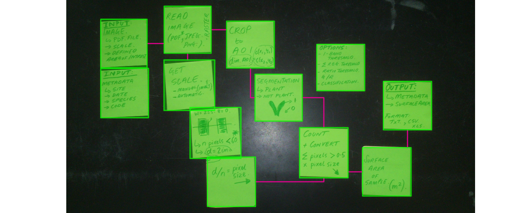

# FAST_LeafArea
A collection of scripts for processing images of plant structures collected using a simple flatbed scanner. These are just control scripts for automated processing using the R package LeafArea (https://cran.r-project.org/web/packages/LeafArea/index.html), which controls [ImageJ](http://rsb.info.nih.gov/ij/).

## Status
Under development and specific to the FAST plant scan images.

## Resources

### Inspiration

+ [Easy-Leaf-Area](https://github.com/heaslon/Easy-Leaf-Area)

### Imagej macros for defining leaf area

+ [leafarea](https://github.com/bblonder/leafarea/blob/master/Code%20-%20ImageJ/Leaf%20area.txt)

## Roadmap
+ adjust run.ij to accomodate ImageJ2 (fiji) 
+ Dockerise Java and ImageJ, see [fiji Dockerfiles](https://github.com/fiji/dockerfiles/tree/61b5365e56b7982825292b7557aff302c7de4bda).
+ Adjust LeafArea::run.ij so as to call Docker container for image processing, see 'running headless' in [example](http://imagej.net/Docker).
+ check if image stacking option is more efficient

## Image processing workflow

